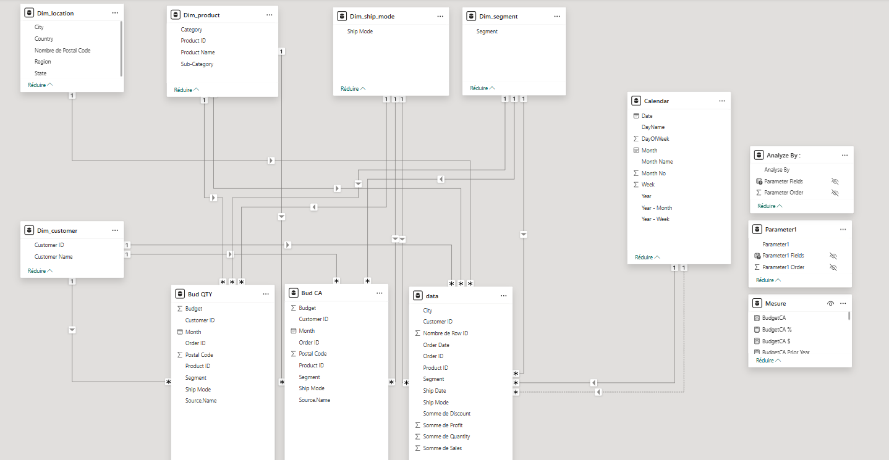

# 📊 Sales Analysis with Power BI

## 📑 Table of Contents

1. [Project Overview](#project-overview)
2. [Data Sources](#data-sources)
3. [Data Transformation and ETL](#data-transformation-and-etl)

   * [Power Query](#power-query)
   * [Data Modeling](#data-modeling)
   * [DAX Calculations](#dax-calculations)
4. [Dashboards](#dashboards)
5. [Results & Insights](#results--insights)
6. [Limitations & Improvements](#limitations--improvements)

---

## 🚀 Project Overview

This project focuses on analyzing **Sales, Profit, and Budget** data using **Power BI**.
The objective is to create interactive dashboards that help track performance across **categories, time periods, and geography**, while comparing actual results to budgets and prior years.

---

## 📂 Data Sources

* **Sales dataset**: Contains transactions including sales, profit, quantity, customer, region, and category.
* **Budget dataset**: Includes yearly and monthly budget allocations by category.
* **Calendar table**: A Date dimension created in Power Query to enable time-based analysis.

---

## 🔄 Data Transformation and ETL

### 🔹 Power Query

I applied several transformations to prepare the data for analysis:

* Cleaned and standardized sales data (removed nulls, renamed columns).
* Created a **Date Table** for time intelligence analysis.
* Merged sales and budget datasets.
* Adjusted data types and applied filters to include only valid transactions.

### 🔹 Data Modeling

The project uses a **Star Schema** approach:

* **Fact Table**: data
* **Dimension Tables**: Date, Product, Customer, Region, Category
* Defined relationships to ensure accurate aggregations and filtering.
* Added hierarchies (Year → Quarter → Month) for drill-down analysis.

📌 Data Model:



### 🔹 DAX Calculations

I created several measures in DAX for KPIs and analysis. Examples include:

```DAX
-- Total Sales
Total Sales = SUM(Sales[Sales])

-- Total Profit
Total Profit = SUM(Sales[Profit])

-- Sales vs Prior Year
Sales Prior Year = CALCULATE([Total Sales], DATEADD('Date'[Date], -1, YEAR))

-- Sales Variance %
Sales % Variance = DIVIDE([Total Sales] - [Sales Prior Year], [Sales Prior Year], 0)

-- Budget Achievement %
Budget Achievement = DIVIDE([Total Sales], [Total Budget], 0)
```

---

## 📊 Dashboards

I built several dashboards in Power BI to visualize performance:

* **Category Analysis**: Sales and Profit by Category.
* **Time Analysis**: Sales vs Budget and Prior Year by Month.
* **Geographical Analysis**: Sales and Profit by Region, State, and City.
* **Performance KPIs**: Variance vs Prior Year and Variance vs Budget.


📌 Project files:  

[Sales Dashboard PDF](Projet-Sales.pdf)  
[Power BI Project File](Projet-Sales.pbix) 

---

## 📈 Results & Insights

* **Furniture** is the largest sales contributor, while **Technology** generates the highest profit.
* **Seasonal peaks** are observed in Q4 across all categories.
* Certain states show **underperformance**, highlighting opportunities for targeted actions.
* Budget vs Actual analysis reveals **over- and under-achieving categories**.

---

## ⚠️ Limitations & Improvements

* The current dataset is historical; a real-time refresh could be implemented via **Power BI Service**.
* Include **forecasting models** for predictive insights.
* Implement **Row-Level Security (RLS)** to restrict access by user in Power BI Service.
